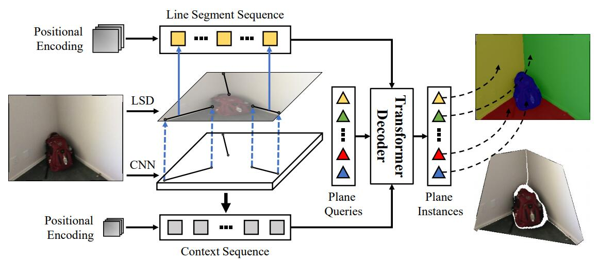

# PlaneTR: Structure-Guided Transformers for 3D Plane Recovery

This is the official implementation of our [ICCV 2021 paper]()



## Getting Started

Clone the repository:
```bash
git clone 
```

We use Python 3.6 and PyTorch 1.6.0 in our implementation, please install dependencies:
```bash
conda create -n planeTR python=3.6
conda activate planeTR
conda install pytorch=1.6.0 torchvision=0.7.0 torchaudio cudatoolkit=10.2 -c pytorch
pip install -r requirements.txt
```

## Data Preparation
We train and test our network on the plane dataset created by [PlaneNet](https://github.com/art-programmer/PlaneNet).
We follow [PlaneAE](https://github.com/svip-lab/PlanarReconstruction) to convert the .tfrecords to .npz files.
Please refer to [PlaneAE](https://github.com/svip-lab/PlanarReconstruction) for more details.

We generate line segments using the state-of-the-art line segment detection algorithm [HAWP](https://github.com/cherubicXN/hawp) with their pretrained model.
The processed line segments data we used can be downloaded [here](https://drive.google.com/drive/folders/1Kj6fvTQfPB4TolwiCRpQnlvJfs2vKvJx?usp=sharing)

The structure of the data folder should be
```bash
plane_data/
  --train/*.npz
  --train_img/*
  --val/*.npz
  --val_img/*
  --train.txt
  --val.txt
```

## Training
Download the pretrained model of [HRNet](https://drive.google.com/drive/folders/1dCq4WxconPEDO8uZq4YDctZ8nxtvEtv8?usp=sharing) 
and place it under the 'ckpts/' folder.

Run the following command to train our network on one GPU:
```bash
CUDA_VISIBLE_DEVICES=0 python train_planeTR.py
```
Run the following command to train our network on multiple GPUs:
```bash
CUDA_VISIBLE_DEVICES=0,1,2 python -m torch.distributed.launch --nproc_per_node=3 --master_port 295025 train_planeTR.py
```

## Evaluation
Download the pretrained model [here](https://drive.google.com/drive/folders/1dCq4WxconPEDO8uZq4YDctZ8nxtvEtv8?usp=sharing) 
and place it under the 'ckpts/' folder.

You can change the 'resume_dir' in 'config_planeTR_eval.yaml' to the path where you save your weight file.

Run the following command to evaluate the performance:
```bash
CUDA_VISIBLE_DEVICES=0 python eval_planeTR.py
```

## Citations
If you find our work useful in your research, please consider citing:
```bash
```

## Contact
[tanbin@whu.edu.cn](tanbin@whu.edu.cn)

[https://xuenan.net/](https://xuenan.net/)

## Acknowledgements
We thank the authors of [PlaneAE](https://github.com/svip-lab/PlanarReconstruction), [PlaneRCNN](https://github.com/NVlabs/planercnn), [interplane](https://github.com/yi-ming-qian/interplane) and [DETR](https://github.com/facebookresearch/detr). Our implementation is heavily built upon their codes.
